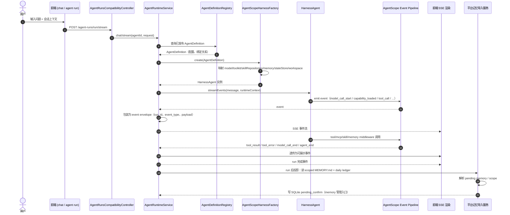

# AgentScope 运行链路总图

本文件给出从前端发起运行到平台 memory 投影回写的完整链路（文档视图）。



对应 1~10 步映射：

```text
1. 前端 chat / agent run
2. Controller
3. AgentRuntimeService
4. AgentDefinition 查询
5. AgentScopeHarnessFactory.create
6. model/tool/mcp/skill/memory/stateStore 注入
7. HarnessAgent.streamEvents / call
8. tool call / mcp call / skill load / memory flush
9. event envelope 转前端
10. run 后 memory import
```

说明：本链路不要求改 runtime 源码，仅用于统一文档口径。  
