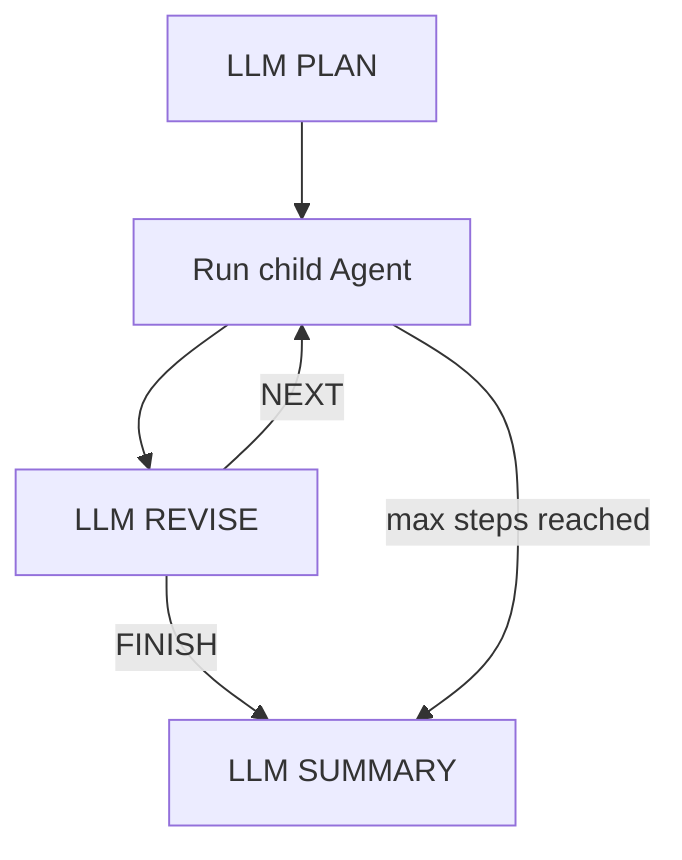

# SUPERVISOR 多步规划（当前仓库）

## 目标行为



- PLAN：输出有序 `steps`，每步包含白名单 `binding_id` 和具体 `instruction`。
- CHILD：串行执行；每一步收到原始用户请求、当前指令和有界的前序结果。
- REVISE：每步后返回 `FINISH` 或 `NEXT`，可以沿用或改变原计划。
- SUMMARY：入口 Supervisor 汇总所有子 Agent 结果。
- 预算：`maxSupervisorSteps` 默认 5，上限 10；触顶强制 SUMMARY。
- 边界：WORKFLOW 是配置写死的链路；SUPERVISOR 是 LLM 动态 plan/revise。

## 当前实现

- Policy：[OrchestrationPolicy](../../src/main/java/io/agent/platform/control/OrchestrationPolicy.java)
- Runtime：[AgentRuntimeService](../../src/main/java/io/agent/platform/runtime/AgentRuntimeService.java)
- Decision model：[OrchestrationDecisionModel](../../src/main/java/io/agent/platform/runtime/OrchestrationDecisionModel.java)
- SQLite/API 兼容：[PlatformCompatibilityState](../../src/main/java/io/agent/platform/web/PlatformCompatibilityState.java)
- 管理页：[AgentsAdmin.vue](../../frontend/live-console/src/pages/AgentsAdmin.vue)
- 时间线：[ActivityTimeline.vue](../../frontend/live-console/src/components/ActivityTimeline.vue)

PLAN 合约：

```json
{"steps":[{"binding_id":"researcher","instruction":"调查问题"}],"reason":"需要先调查"}
```

REVISE 合约：

```json
{"action":"NEXT","next_step":{"binding_id":"reviewer","instruction":"复核调查结论"},"remaining_steps":[],"reason":"需要独立复核"}
```

旧的 `{"binding_ids":[...]}` PLAN 输出仍可解析，已有 Supervisor 配置不需要重建。

## 安全与失败行为

- LLM 只能选择配置中的 binding；未知 ID 不执行。
- 子 Agent 继续使用 binding 级 Tool/MCP 白名单，空列表表示无工具。
- PLAN 失败时按配置顺序回退；REVISE 失败时执行原计划下一步，没有剩余步骤则结束。
- 子 Agent 每次调用受 `subagentTimeoutMs` 限制，总调用次数受 `maxSupervisorSteps` 限制。
- 每个子结果进入决策提示前最多保留 2,000 字符，避免上下文无界增长。

## 事件

- `supervisor_plan_start` / `supervisor_plan`
- `supervisor_step_start` / `supervisor_subagent_result`
- `supervisor_revise_start` / `supervisor_revise`
- `supervisor_summary_start` / `supervisor_summary_end`

事件包含 step、binding、模型、决策来源和耗时，原始决策提示与模型原文不落库。

## 验证

- 后端全量测试通过。
- 前端 TypeScript 检查和生产构建通过。
- Playwright 验证最大步骤从 5 修改为 3、保存、概览展示和 API 回读。
- 真实 LLM E2E：`run_de18f87c844043448c41d31e881ee5c2`，2 次子 Agent 调用，REVISE 顺序为 `NEXT`、`FINISH`，最终输出 `E2E_SUPERVISOR_OK`。

## 非目标

- 本轮不做同一步内的并行 fan-out；动态链路必须串行才能利用前一步结果。
- 不使用 Harness 隐式 spawn；平台 Runtime 负责所有子 Agent 调用和能力隔离。
- 不新增物理表；字段随 Agent orchestration JSON 落库。
